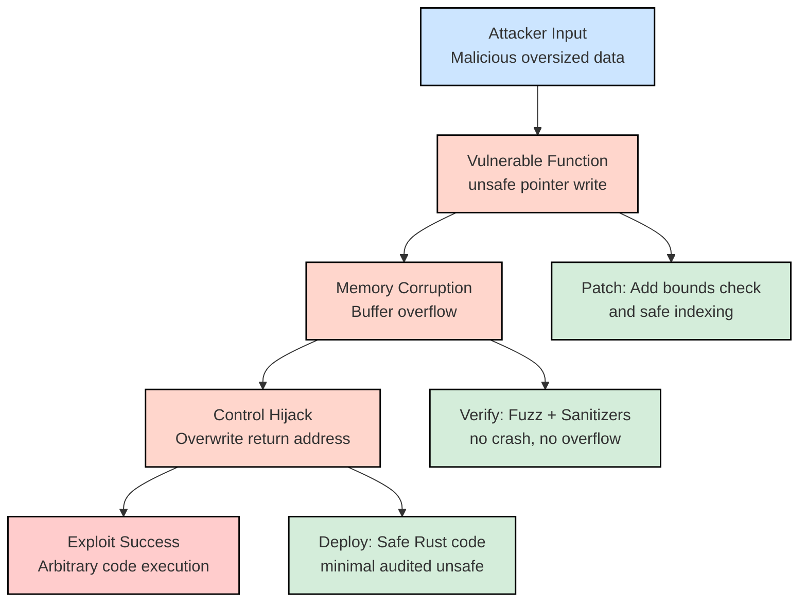

# **Project 1 — Exploit and Patch**

**Theme:** *Breaking and Fixing Unsafe Rust*

---

## **1. Project Overview**

In this project, you will:

1. Receive a small Rust codebase that contains security vulnerabilities (in `unsafe` code and/or unsafe FFI calls to C).
2. Act as a **security researcher** — identify and exploit at least one critical flaw.
3. Act as a **defender** — patch the flaw(s) without breaking functionality.
4. Document both the attack path and the fix.

---

## **2. Narrative Setup**

You have been contracted by a startup developing a high-speed image processing service in Rust.
They ported parts of the pipeline from legacy C code and sprinkled in `unsafe` Rust for performance.
A bug bounty hunter reported “possible memory corruption” but gave no details. Your job is to:

* **Find** the bug.
* **Exploit** it.
* **Patch** it.
* **Prove** the fix works.

---

## **3. Skills You Will Practice**

* Reading and auditing Rust `unsafe` blocks.
* Memory corruption analysis.
* Fuzz testing with `cargo fuzz`.
* Using debugging tools (`gdb`, `lldb`, sanitizers).
* Writing clear security documentation.

---

## **4. Deliverables**

1. **Exploit Proof** — input, sequence, or script that triggers the bug.
2. **Root Cause Analysis** — explain the vulnerable code path.
3. **Patch** — secure modification to the codebase.
4. **Verification** — proof that the bug no longer occurs (tests, fuzzing runs, sanitizer output).
5. **Write-Up** — in Markdown or PDF, describing:

   * Vulnerability category (buffer overflow, use-after-free, etc.)
   * Attack surface.
   * Exploitation impact.
   * Fix rationale.

---

## **5. Starter Code**

Here’s a sample starting point (put in `src/main.rs`):

```rust
use std::io::{self, Read};
use std::slice;

#[no_mangle]
pub extern "C" fn process_data(ptr: *mut u8, len: usize) {
    unsafe {
        let data = slice::from_raw_parts_mut(ptr, len);
        for i in 0..len {
            // Intentionally unsafe indexing without bounds checks
            *data.get_unchecked_mut(i) = data[i].wrapping_add(1);
        }
    }
}

fn main() {
    println!("Enter your data (binary or text):");
    let mut input = Vec::new();
    io::stdin().read_to_end(&mut input).unwrap();

    // Intentionally unsafe: wrong length passed in
    unsafe {
        let ptr = input.as_mut_ptr();
        process_data(ptr, input.len() + 32); // Overflows!
    }

    println!("Processed data: {:?}", input);
}
```

---

## **6. Suggested Workflow**

### **Phase 1 — Recon & Vulnerability Discovery**

* Compile with debug symbols:

  ```bash
  cargo build
  ```
* Run with various inputs and observe:

  ```bash
  ./target/debug/project1 < inputfile
  ```
* Use `cargo fuzz`:

  ```bash
  cargo fuzz init fuzz_target
  ```

  Create a fuzz target that calls `process_data` with random buffers.
* Try AddressSanitizer:

  ```bash
  RUSTFLAGS="-Zsanitizer=address" cargo +nightly run
  ```

### **Phase 2 — Exploitation**

* Understand memory layout in Rust for stack/heap.
* Attempt to overwrite nearby memory.
* (Advanced) Try to corrupt a function pointer or control flow.
* Document **exact input** that causes failure or corruption.

### **Phase 3 — Patching**

* Enforce bounds checking:

  * Replace `.get_unchecked_mut` with safe indexing.
  * Ensure correct `len` is passed to `process_data`.
* Add unit tests to prevent regression.
* Run `cargo fuzz` again — ensure no crashes.

### **Phase 4 — Verification**

* Test with:

  * Short inputs.
  * Extremely long inputs.
  * Edge cases (empty input, all zeros, binary blobs).
* Confirm sanitizer reports clean run.

---

## **7. Hints & Resources**

* **Documentation**:

  * [Rustonomicon — Unsafe Code Guidelines](https://doc.rust-lang.org/nomicon/)
  * [cargo-fuzz guide](https://rust-fuzz.github.io/book/cargo-fuzz.html)
* **Tools**:

  * `miri` for detecting undefined behavior:

    ```bash
    cargo miri run
    ```
  * `valgrind` on the compiled binary (for C-interfaced code).
* **Inspiration**:

  * CVE write-ups on buffer overflows in C/C++.
  * Old school “smash the stack” tutorials — then adapt the concepts to Rust.

---

## **8. Self-Evaluation Checklist**

Before submitting your write-up, ensure:

* [ ] I can explain why the bug exists.
* [ ] I have a working exploit trigger.
* [ ] I applied a patch that fixes the bug.
* [ ] I verified the fix with fuzzing and testing.
* [ ] My documentation is clear and reproducible.

---

## **9. Optional Challenge: The Overachiever’s Path**

* Implement a **minimal Return-Oriented Programming (ROP) chain** in a C function called from Rust via FFI, just to demonstrate the danger.
* Show how modern mitigations (stack canaries, DEP, ASLR) change the exploitation process.

---

## Explot & Patch Attack Chain


