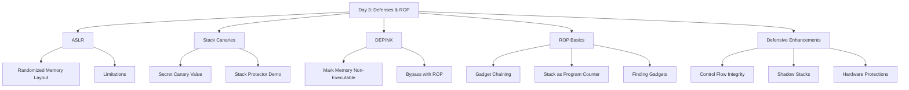

# **Day 3 – Defenses & Return-Oriented Programming (ROP)**

## **Learning Objectives**

By the end of this day, learners will be able to:

1. Explain how **ASLR**, **stack canaries**, and **DEP** work as memory corruption defenses.
2. Understand the fundamentals of **Return-Oriented Programming** and why it bypasses traditional defenses.
3. Trace and construct a basic ROP chain, first in C, then in `unsafe` Rust.
4. Use `gdb` effectively for tracing payload execution and analyzing control flow hijacks.

---

## **Epic Narrative Hook**

> Imagine you’re an elite burglar trying to rob a bank — but the vault location changes every night (**ASLR**), the vault door has hidden sensors that trip an alarm when touched (**stack canaries**), and even if you somehow open it, the cash is stored inside a room with pressure-sensitive floors (**DEP**).
>
> ROP is the burglar’s ultimate workaround — breaking into the bank without breaking the vault, by using the building’s own maintenance ladders and elevators (**gadgets**) to reach the treasure.

We’ll play both sides today — defender and attacker — learning how to build these “vault” defenses and how attackers bypass them.

---

## **Lecture Outline**

### **Part 1 – Defensive Walls of Modern Systems**

#### **1. Address Space Layout Randomization (ASLR)**

* **Goal:** Make memory addresses unpredictable.
* Randomizes stack, heap, shared libraries.
* Forces attackers to guess or leak addresses before exploiting.
* **Demo:** Show the different memory maps from two runs of the same program using:

  ```bash
  cat /proc/$$/maps
  ```
* **Limitations:** Partial ASLR (e.g., 32-bit), info leaks.

---

#### **2. Stack Canaries**

* **Goal:** Detect stack smashing before function return.
* Works by placing a secret value (“canary”) before return address.
* On function return, canary is checked — if altered, program aborts.
* **Analogy:** A wax seal on a treasure chest.
* **Demo:** Compile with/without `-fstack-protector` in C, observe behavior.

---

#### **3. Data Execution Prevention (DEP) / NX Bit**

* **Goal:** Mark memory regions as non-executable.
* Stops classic shellcode execution from stack/heap.
* Modern CPUs enforce this via **NX bit**.
* **Bypass:** ROP — use existing executable code in memory.

---

### **Part 2 – Return-Oriented Programming (ROP)**

#### **1. Why ROP Exists**

* DEP/NX stops injecting shellcode, so attackers “recycle” code already in memory.
* ROP chains together **gadgets** — short sequences ending in `ret`.

#### **2. Anatomy of a ROP Chain**

* **Gadget Example:**

  ```asm
  pop eax
  ret
  ```
* Chain gadgets to achieve arbitrary logic.
* Stack is “program counter” in disguise.
* Often combined with ASLR bypass (via leaks) or partial overwrites.

#### **3. Finding Gadgets**

* Tools: `ROPgadget`, `radare2`, `ROPium`.
* **Example Search:**

  ```bash
  ROPgadget --binary vuln_bin
  ```

---

### **Part 3 – Defender’s Perspective**

* **Control Flow Integrity (CFI):** Enforces valid control transfers.
* **Shadow stacks:** Duplicate stack for return addresses.
* **Hardware features:** Intel CET, ARM Pointer Authentication.

---

## **Lab Setup & Flow**

### **Step 1 – C Simulation**

1. Write a vulnerable C program (buffer overflow).
2. Disable ASLR for controlled environment:

   ```bash
   echo 0 | sudo tee /proc/sys/kernel/randomize_va_space
   ```
3. Find and chain gadgets using `ROPgadget`.
4. Execute exploit, observe shell spawn.

---

### **Step 2 – Port to Unsafe Rust**

1. Translate vulnerable C logic into `unsafe` Rust.
2. Replicate exploit, adjusting offsets due to Rust’s different calling conventions.
3. Debug with `gdb`:

   ```bash
   gdb target/debug/vuln
   ```

---

### **Step 3 – Bonus Challenge**

* Re-enable ASLR and try to bypass via **memory leak** in the program.

---

## **Evening Self-Study**

**Reading:** *ROP Primer*
**Challenge:** Build a “ROP sandbox” where you deliberately construct safe, educational ROP chains for learning.

---

## **Mermaid Lecture Map**


