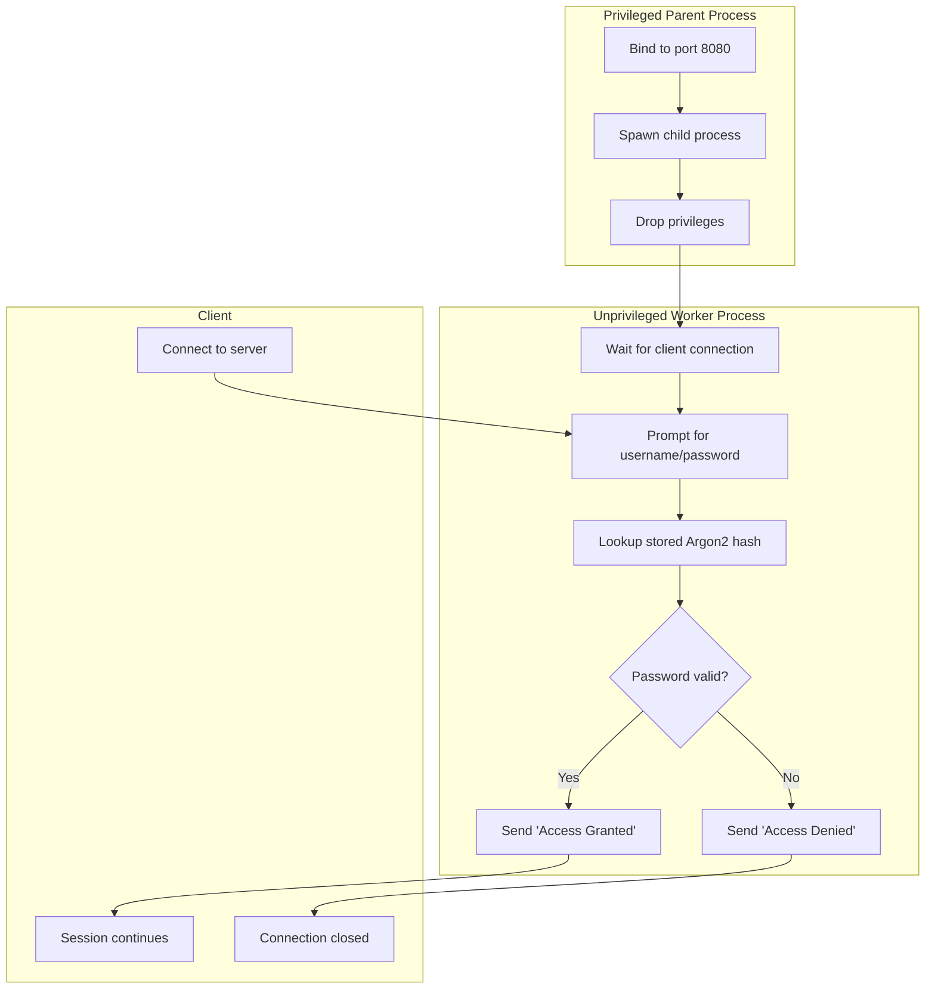

# **Day 4 — Lab: Privilege Separation & Authentication**

## **Learning Objectives**

By the end of this lab, you will:

1. Implement **process-level privilege separation** in Rust.
2. Use the `argon2` crate to **securely hash and verify passwords**.
3. Combine both into a **mini privilege-separated server** with authentication.

---

## **Part 1 – Privilege Separation Lab**

### **1.1 Overview**

We’ll build a small TCP server with:

* **Privileged parent process** — starts on a privileged port (e.g., 8080) and binds the socket.
* **Unprivileged child process** — handles client requests without root privileges.

---

### **1.2 Step-by-Step**

#### **Step 1 — Create project**

```bash
cargo new privilege_server
cd privilege_server
```

#### **Step 2 — Basic TCP server**

In `src/main.rs`:

```rust
use std::net::TcpListener;
use std::io::{Read, Write};

fn main() {
    let listener = TcpListener::bind("127.0.0.1:8080").expect("bind failed");
    println!("Privileged process: Listening on port 8080");

    for stream in listener.incoming() {
        match stream {
            Ok(mut stream) => {
                println!("Connection received");
                stream.write_all(b"Hello from privileged process!\n").unwrap();
            }
            Err(e) => eprintln!("Error: {}", e),
        }
    }
}
```

#### **Step 3 — Fork into privileged & unprivileged**

We’ll use `nix` crate for Unix process handling:

```toml
# Cargo.toml
[dependencies]
nix = { version = "0.27", default-features = false, features = ["process", "user"] }
```

```rust
use nix::unistd::{fork, ForkResult, setuid, Uid};
use std::net::TcpListener;
use std::io::{Read, Write};

fn main() {
    let listener = TcpListener::bind("127.0.0.1:8080").expect("bind failed");

    match unsafe { fork() } {
        Ok(ForkResult::Parent { .. }) => {
            println!("Privileged parent bound the socket, exiting.");
        }
        Ok(ForkResult::Child) => {
            // Drop privileges — switch to an unprivileged user (e.g., UID 1000)
            setuid(Uid::from_raw(1000)).expect("failed to drop privileges");
            println!("Now running as unprivileged user");

            for stream in listener.incoming() {
                let mut stream = stream.unwrap();
                let mut buffer = [0; 512];
                let n = stream.read(&mut buffer).unwrap();
                stream.write_all(&buffer[0..n]).unwrap();
            }
        }
        Err(_) => eprintln!("Fork failed"),
    }
}
```

---

### **1.3 Checkpoint**

Run the program as root (or using `sudo`) to see the privilege drop in action.
Confirm the UID change using `id` in code after `setuid`.

### **1.4 Unix Process Operation Refresh**

Note that if you run this code with `sudo` and it forks, you’ll actually have **two processes**:

* The **parent** (privileged, exits quickly)
* The **child** (unprivileged, keeps running the server)

Because we’re forking and the parent calls `exit` without `wait`ing, the child **isn’t attached to your shell anymore** — it becomes an *orphan*, often adopted by `init` (PID 1 or `systemd`). Thus, `ps` without the right filters doesn’t show it in your current user’s process list. If you ran `ps` without `-e` or `-ef`, you only see processes for your current session/tty. After the fork and `exit` of the parent, the child isn’t attached to your shell and isn’t your session leader, so it doesn’t appear in `ps`’s default output.

Here are how to find it:

```bash
# assume you compiled your program to `test_privilege`
ps -ef | grep test_privilege
```

```bash
# Since you know it’s bound to `127.0.0.1:8080`:
sudo lsof -iTCP:8080 -sTCP:LISTEN
```

---

## **Part 2 – Authentication Lab**

### **2.1 Overview**

We’ll implement **secure password storage** and verification using `argon2`.

---

### **2.2 Step-by-Step**

#### **Step 1 — Add dependencies**

```toml
[dependencies]
argon2 = "0.5"
rand_core = "0.6"
```

#### **Step 2 — Implement password hashing**

```rust
use argon2::{Argon2, PasswordHasher, PasswordVerifier};
use argon2::password_hash::{rand_core::OsRng, SaltString, PasswordHash};

fn main() {
    let password = "MySecurePassword123";

    // Generate random salt
    let salt = SaltString::generate(&mut OsRng);
    let argon2 = Argon2::default();

    // Hash password
    let password_hash = argon2.hash_password(password.as_bytes(), &salt).unwrap().to_string();
    println!("Hashed password: {}", password_hash);

    // Verify
    let parsed_hash = PasswordHash::new(&password_hash).unwrap();
    match argon2.verify_password(password.as_bytes(), &parsed_hash) {
        Ok(_) => println!("Password is valid!"),
        Err(_) => println!("Invalid password!"),
    }
}
```

---

## **Part 3 – Integration Challenge**

**Goal:** Merge both parts into a **privilege-separated authentication server**:

* Parent process binds socket and drops privileges.
* Child process:

  * Prompts client for username & password.
  * Verifies password with Argon2.
  * If valid → sends “Access Granted”.
  * If invalid → sends “Access Denied” and closes connection.

---

## **Part 4 – Bonus Exercises**

1. Implement **account lockout** after 3 failed logins.
2. Add **TOTP-based MFA** using the `otpauth` crate.
3. Store user data in a file with hashed passwords.

---

## **Deliverables**

* A `privilege_server` directory with:

  * `src/main.rs` (privilege separation + authentication code)
  * `users.txt` (username\:argon2hash)
* A `README.md` describing:

  * How to run it.
  * Security considerations.

---

## Privilege-Separated Authentication Server Flow


