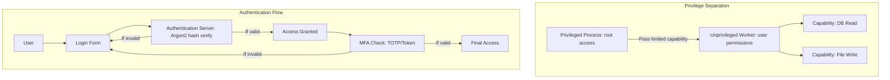

# **Day 4 — Privilege Separation & Authentication**

## **Opening Story: The Castle and the Keys**

Imagine a medieval fortress. Inside: vaults of gold (your data), guards (processes), and gates (APIs). The king (root) once trusted everyone in the court with the master key—until one night, a single traitor used that key to rob the treasury.
From that day, the king decreed:

* No one gets the master key except when absolutely necessary.
* Each guard gets only the keys for their own gate.
* Visitors must prove their identity, and the proof must be hard to fake.

This is **privilege separation** and **authentication**—today’s theme.

---

## **Part 1 – Privilege Separation**

### **1.1 The Principle of Least Privilege**

> Give every entity only the permissions it needs to do its job—no more.

* **Why it matters:**

  * Reduces attack surface.
  * Limits damage if a process is compromised.
* **Examples:**

  * Database user with read-only access for reporting tools.
  * Web server process that can’t write to system files.

---

### **1.2 Capability Systems**

* **Capabilities** = unforgeable tokens granting specific access rights.
* Contrast with traditional *access control lists (ACLs)*:

  * ACL: “The room knows who can enter.”
  * Capability: “The key you hold decides where you can go.”
* In OS terms:

  * File descriptors in Unix are capabilities.
  * Capsicum (FreeBSD) and seL4 are capability-based systems.

---

### **1.3 Privilege Separation in Practice**

In modern security-sensitive applications:

* Split code into **privileged** and **unprivileged** parts.
* Use **process boundaries** for isolation:

  * Privileged process runs with root (only for setup, e.g., binding to port 80).
  * Drops privileges, or passes control to unprivileged process for main work.
* **Real-world examples:**

  * OpenSSH: separates authentication agent from session process.
  * Chrome: site isolation, sandboxing renderers.

---

## **Part 2 – Authentication**

### **2.1 The Goal**

Verify identity before granting access.
Questions we ask:

1. **Who are you?**
2. **Can you prove it?**
3. **Is the proof fresh and hard to fake?**

---

### **2.2 Factors of Authentication**

1. **Something you know** — passwords, PINs.
2. **Something you have** — hardware token, phone app.
3. **Something you are** — biometrics (fingerprint, face ID).

**Multi-factor authentication (MFA)** = combine factors for stronger security.

---

### **2.3 Password Authentication Basics**

* **Why passwords are risky:**

  * Weak or reused passwords.
  * Stolen via phishing or breaches.
* **Defenses:**

  * Length & complexity requirements.
  * Rate-limiting login attempts.
  * Salted hashing.

---

### **2.4 Salting and Hashing**

* **Hash**: one-way function → turns password into fixed-length digest.
* **Salt**: random data appended before hashing to prevent rainbow table attacks.
* **Argon2**:

  * Memory-hard (resists GPU/ASIC brute force).
  * Recommended over older PBKDF2/bcrypt.

---

### **2.5 Biometrics**

* Pros: can’t be forgotten, hard to share.
* Cons: can’t be changed if leaked, may have false positives/negatives.
* Use in **multi-factor** context, not as sole authentication.

---

## **Part 3 – Case Study**

**The Target Data Breach (2013)**
Attackers stole network credentials from a third-party HVAC vendor.
Why it worked:

* Overprivileged vendor account (had access to internal payment systems).
* Weak password security.

**Lessons:**

1. Limit privileges per role.
2. Monitor logins from unexpected locations.
3. Require MFA for all high-privilege accounts.

---

## **Part 4 – Lab Integration (Preview)**

This afternoon you’ll:

1. **Privilege Separation Lab**:

   * Build a Rust mini-server.
   * Separate it into privileged/unprivileged processes.
2. **Authentication Lab**:

   * Implement Argon2 password hashing.
   * Verify passwords securely, resisting timing attacks.

---

## **Evening Challenge**

* Extend your server to:

  1. Support **two-factor authentication** with TOTP.
  2. Log failed login attempts and lock accounts temporarily.

---

## **Self-Study Reading**

* *Security Engineering*, Ross Anderson — Ch. 4: “Access Control”
* Argon2 RFC: [RFC 9106](https://datatracker.ietf.org/doc/html/rfc9106)
* “The Principle of Least Privilege” — Saltzer & Schroeder (1975)

---

## Visualization

