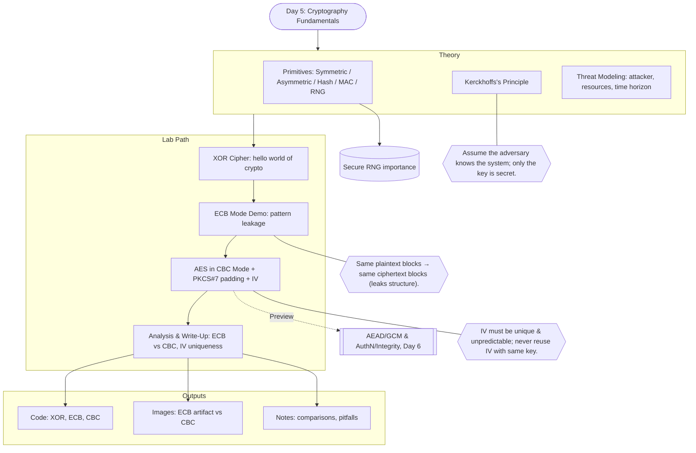
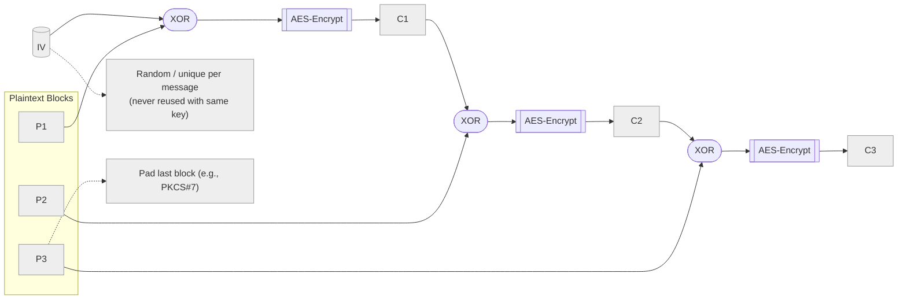

# **Day 5 – Cryptography Fundamentals**

## **1. Opening Narrative – The Ancient Cipher Scroll**

Imagine you are a cryptographer in the court of a powerful kingdom.
An intercepted message contains the phrase:

> "The nightingale sings at midnight."

If the enemy reads it, spies will die. You have only hours to protect the kingdom. The tools in your hands? Strange, beautiful algorithms that turn meaning into noise — and noise back into meaning.

This is the day you step into the shoes of history’s greatest cryptographers, from the Spartan scytale to the enigma-breaking minds of Bletchley Park, and forward to the AES ciphers securing your bank account.

Today, you won’t just learn how cryptography works — you’ll **implement it**, understand its **mathematical backbone**, and wield it with the same precision as those who protect nations and systems from ruin.

---

## **2. Learning Objectives**

By the end of this lecture, you will:

* Understand **cryptographic primitives** and their role in security.
* Differentiate **symmetric** from **asymmetric** cryptography.
* Explain **Kerckhoffs’s Principle** and why “security through obscurity” fails.
* Analyze **threat models** to choose the right cryptographic tool.
* Implement basic ciphers in Rust and evaluate their strengths/weaknesses.

---

## **3. Core Concepts**

### **3.1 Cryptographic Primitives**

Cryptography is built like LEGO — small, well-defined blocks:

* **Symmetric Encryption** – same key to encrypt & decrypt. Fast, but key distribution is a pain.
* **Asymmetric Encryption** – different keys (public & private). Solves distribution, but slower.
* **Hash Functions** – one-way transformations (SHA-256).
* **Message Authentication Codes (MACs)** – integrity + authenticity checks.
* **Random Number Generators (RNGs)** – the unsung heroes; weak randomness = broken crypto.

> **Epic analogy:** Symmetric crypto is like a shared diary key; asymmetric crypto is like a public lock everyone can close but only you can open.

---

### **3.2 Symmetric vs. Asymmetric**

| Feature         | Symmetric             | Asymmetric                |
| --------------- | --------------------- | ------------------------- |
| Keys            | Same for enc/dec      | Public & private          |
| Speed           | Fast                  | Slower                    |
| Use Cases       | Bulk data encryption  | Key exchange, digital sig |
| Vulnerabilities | Key distribution risk | Longer keys needed        |

---

### **3.3 Kerckhoffs’s Principle**

A secure system must remain secure **even if everything about it except the key is public**.

**Why?**

* Algorithms get reverse-engineered.
* Hidden designs often have undiscovered flaws.
* Public scrutiny makes algorithms stronger (e.g., AES selection process).

---

### **3.4 Threat Models in Cryptography**

Ask yourself:

* Who is the attacker?
* What resources do they have? (e.g., quantum computers)
* What are you protecting — and for how long?
* What is the cost of failure?

Example:

* **Low threat:** Hiding your Netflix password from your sibling.
* **High threat:** Protecting government secrets against nation-state adversaries.

---

## **4. Worked Example: XOR Cipher**

The XOR cipher is the “hello world” of crypto.

**Concept:**

```
ciphertext = plaintext XOR key
plaintext  = ciphertext XOR key
```

* Simple, reversible, and… **weak**. If the key repeats, frequency analysis destroys it.
* But it’s a perfect stepping stone to understanding block ciphers.

---

## **5. Cipher Modes: ECB vs. CBC**

* **ECB (Electronic Codebook)** – Same plaintext block → same ciphertext block. Leaks patterns.
  *Example: The “Penguin in ECB” meme.*
* **CBC (Cipher Block Chaining)** – XOR each plaintext block with previous ciphertext block. Removes pattern leaks, but needs an Initialization Vector (IV).

---

## **6. Case Study – When Crypto Fails**

* **WEP (Wi-Fi Encryption)** – Used RC4 with a weak key scheduling algorithm. Attackers could recover keys in minutes.
* **Lessons learned:**

  1. Don’t invent your own crypto.
  2. Good algorithms can still fail with bad implementation.
  3. Keys, IVs, and randomness matter.

---

## **7. Guided Rust Implementation Outline**

**Example: AES Encryption with `aes` crate**

```rust
use aes::Aes128;
use block_modes::{BlockMode, Cbc};
use block_modes::block_padding::Pkcs7;
use hex_literal::hex;

type Aes128Cbc = Cbc<Aes128, Pkcs7>;

fn main() {
    let key = b"verysecretkey!!";  // 16 bytes
    let iv = b"uniqueinitvectr";   // 16 bytes

    let plaintext = b"Top secret message!";
    let cipher = Aes128Cbc::new_from_slices(key, iv).unwrap();

    // Encrypt
    let ciphertext = cipher.encrypt_vec(plaintext);
    println!("Ciphertext: {:?}", ciphertext);

    // Decrypt
    let decrypted = cipher.decrypt_vec(&ciphertext).unwrap();
    println!("Decrypted: {:?}", String::from_utf8(decrypted).unwrap());
}
```

* Try changing ECB to CBC and observe differences.
* Experiment with wrong IVs or keys to see how decryption fails.

---

## **8. Discussion Prompts**

1. Why is key distribution the Achilles’ heel of symmetric cryptography?
2. What could break AES in the next 20 years? (Hint: think quantum.)
3. When is Kerckhoffs’s principle ignored in real-world products?

---

## **9. Evening Challenge**

* Implement an XOR cipher in Rust.
* Encrypt a message using ECB and CBC modes — visualize the output as an image to see the difference.
* Write a short reflection on how crypto’s **math + design choices** shape its strength.

---

Awesome — here’s a clean Mermaid diagram set for **Day 5** that maps the full learning flow and then zooms into CBC internals.

---

## Big-Picture Flow (theory → XOR → ECB → CBC → analysis)



---

## Zoom-In: How CBC Encryption Chains Blocks


