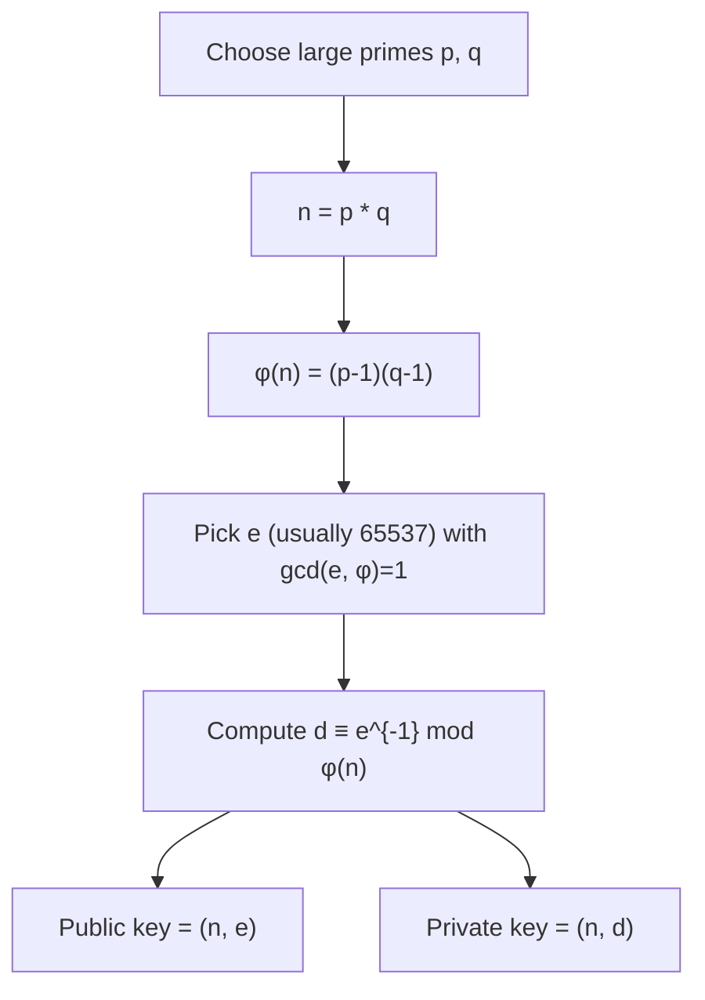
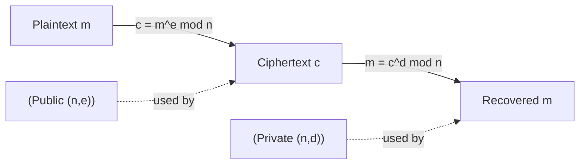
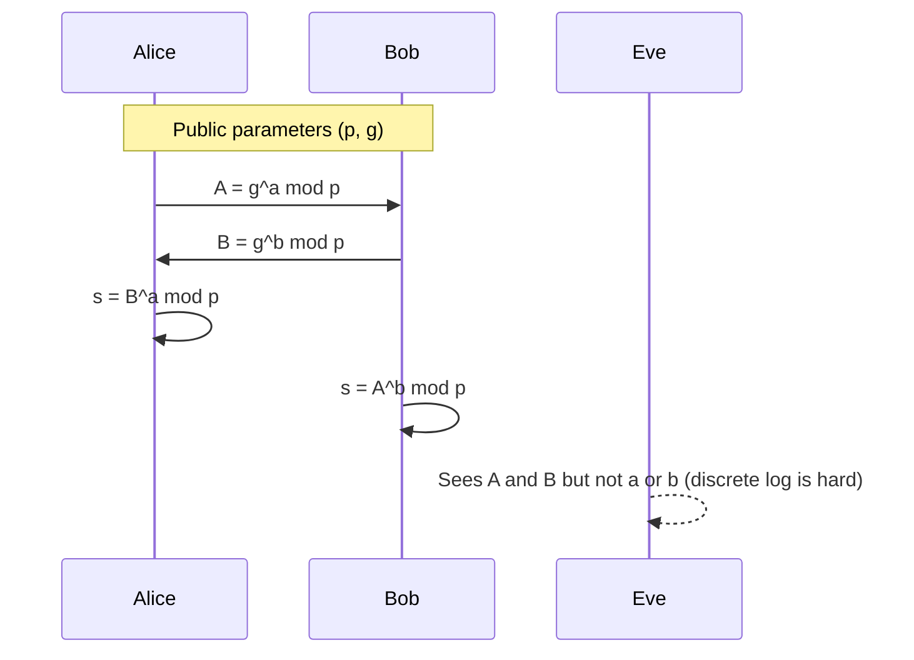
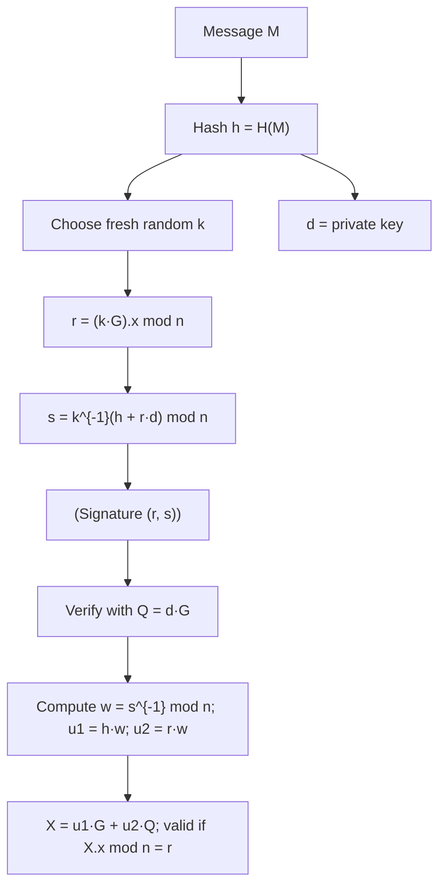
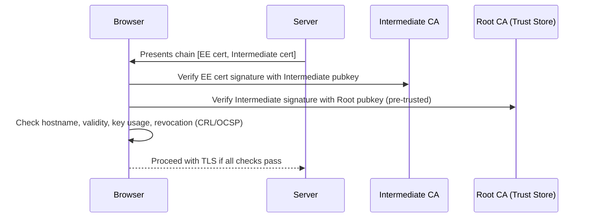
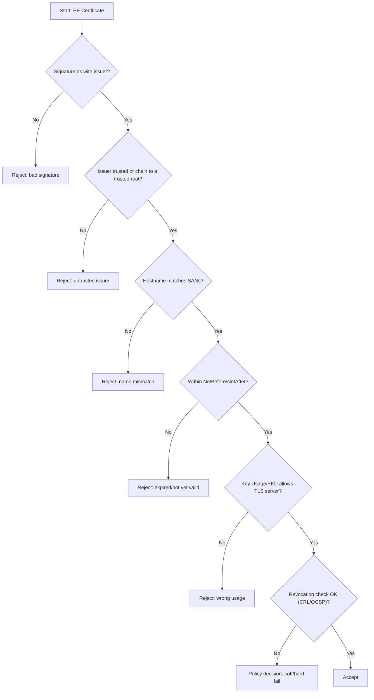

# Day 7 — Public-Key Cryptography & PKI

## 0) North Star

By tonight you should be able to:

* explain RSA, Diffie–Hellman, and ECDSA at the “math-story” level,
* implement safe RSA (OAEP) and perform key agreement (X25519) in Rust,
* parse and sanity-check X.509 certificates,
* articulate how PKI binds identity to keys — and how it can fail.

---

## 1) The Epic Hook: “Whispering in a Crowd”

Yesterday you learned to protect bytes with symmetric keys. Today we answer: **how do we create that key in the first place, over an eavesdropped network?**
Public-key crypto solves this bootstrap; PKI solves the “who are you, really?” part.

---

## 2) Visual Explanations

### 2.1 RSA — Keygen → Encrypt → Decrypt

**Safety notes**: never “raw RSA”. Use OAEP for encryption and PSS for signatures. Use hybrid encryption (RSA/ECDH for keys; AES/ChaCha20 for data).

---

### 2.2 Diffie–Hellman (classic) — Key Agreement

**Modern practice**: use elliptic-curve DH (X25519) — faster, shorter keys, safer defaults.

---

### 2.3 ECDSA — Signing & Verifying

---

### 2.4 PKI — Who Do You Trust?

**Mental model**: crypto proves *a key*; PKI asserts *whose key*.

---

## 3) Pitfalls & Red Flags (the “security engineer’s spidey-sense”)

* Using RSA to encrypt bulk data (don’t — use hybrid).
* PKCS#1 v1.5 padding for encryption (use **OAEP**).
* Deterministic or reused ECDSA nonce `k` (catastrophic key leak).
* Trusting “TLS is present” without validating the **chain, hostname, validity, EKU, and revocation**.
* Rolling your own randomness or KDF.

---

## 4) Quick Checks (self-quiz)

1. Why does public-key crypto solve the “first key” problem that symmetric crypto has?
2. In DH, Eve sees $g^a$ and $g^b$. Why can’t she compute the shared secret?
3. Name three certificate validation checks a browser performs beyond signature verification.
4. Why is ECDSA nonce reuse fatal?
5. When would you pick X25519 over P-256 (and vice versa)?

---

## 5) Reading & Reflection (evening)

* Boneh & Shoup, Chapters 12–14 (RSA, DH, signatures, PKI).
* Case study: DigiNotar 2011 — how a CA breach undermines the web of trust.
* Write a one-page reflection: *“Crypto proves keys; PKI asserts identity — where can each layer fail?”*

---

## 6) Tomorrow’s Bridge

We’ll take these primitives into the real world: **TLS**. You’ll trace the handshake, spot where DH/X25519, signatures, and certificates fit, and build a small TLS service with `rustls`.

---

### (optional) Bonus Diagram — Certificate Path Validation (decision flow)

