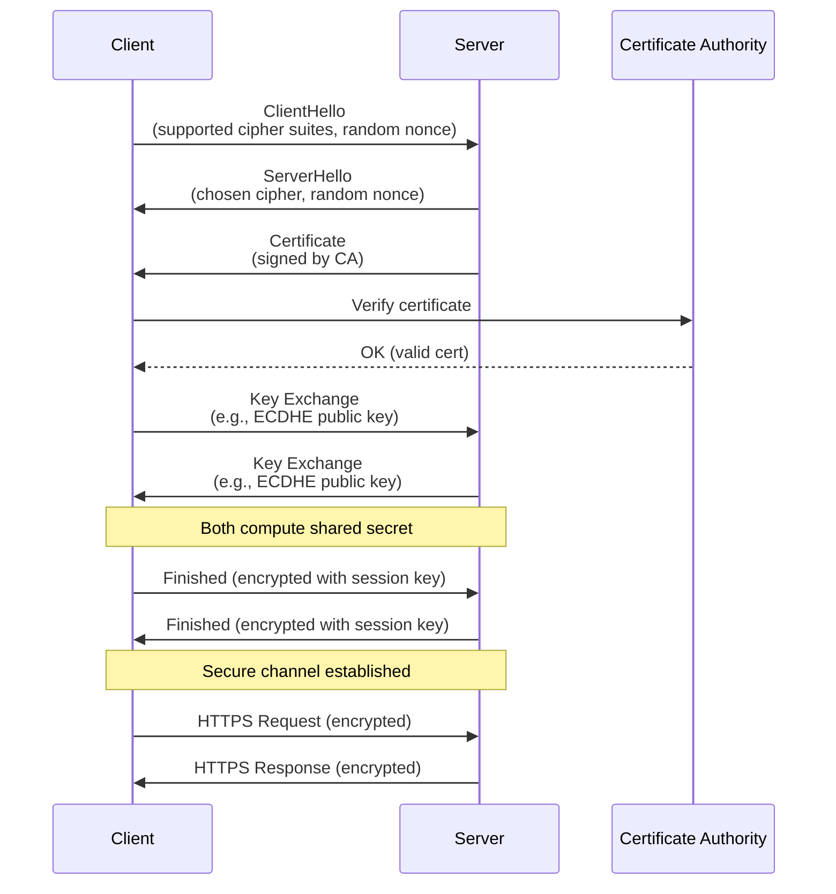
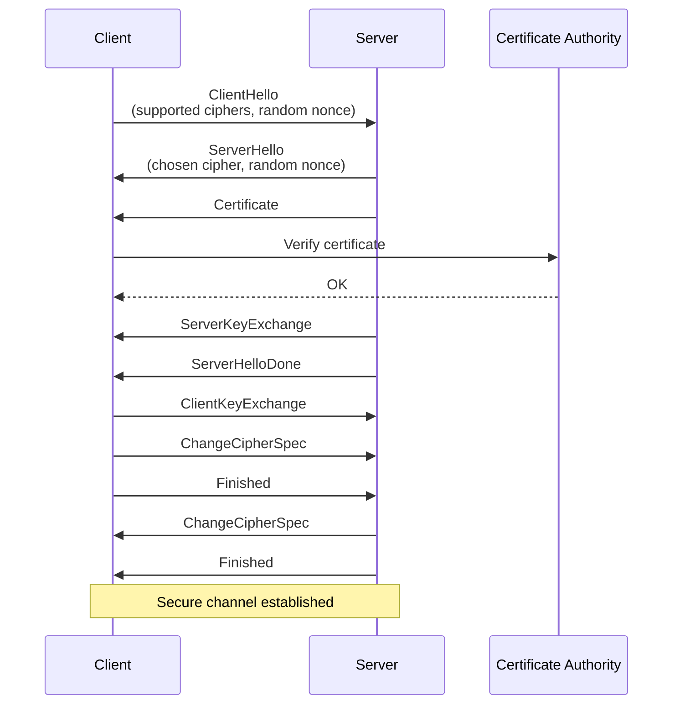
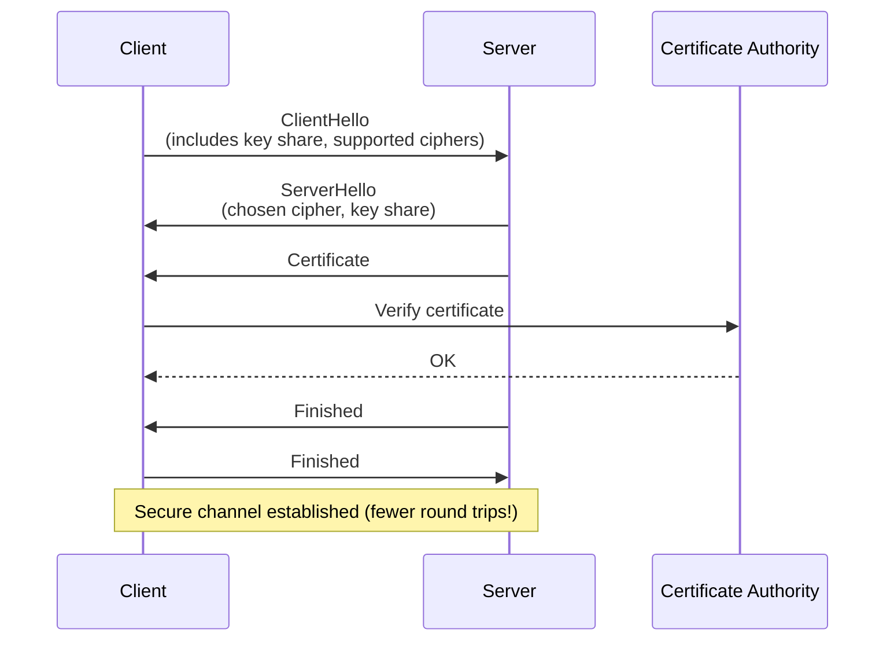

# **Day 8 – Secure Communication: TLS, HTTPS**

## 🎯 Learning Objectives

By the end of today, you should be able to:

1. Explain how TLS secures communication over untrusted networks.
2. Walk through the TLS handshake step by step.
3. Understand how session keys are negotiated and used.
4. Recognize weaknesses and how MITM attacks exploit them.
5. Relate TLS/HTTPS to real-world applications like browsers, APIs, and secure messaging.

---

## 1. The Story: From HTTP to HTTPS

Imagine sending a love letter across a crowded café.

* With **HTTP**, you hand it to the loudest person in the room, who shouts it out for all to hear.
* With **HTTPS**, you first lock it in a box that only the recipient has the key to.

The internet is that café: every router, ISP, and server in between can peek at your traffic. HTTPS — built on **TLS** (Transport Layer Security) — transforms that open café into a secure whisper between you and the recipient.

---

## 2. Why TLS? The Three Goals

TLS is not just about encryption. It guarantees **three pillars**:

* 🔒 **Confidentiality** — attackers cannot eavesdrop.
* 🔏 **Integrity** — attackers cannot alter communication unnoticed.
* ✅ **Authentication** — you know you’re talking to the right server (and sometimes, the server knows you).

Together, these guard against classic attacks: sniffing, tampering, and impersonation.

---

## 3. Anatomy of TLS

TLS is a protocol *layered* between TCP and application protocols (like HTTP, SMTP, IMAP).

* **Handshake Phase**

  * Negotiate algorithms (cipher suites).
  * Exchange keys securely.
  * Authenticate the server (and sometimes client).

* **Record Phase**

  * Encrypt and authenticate application data with symmetric session keys.
  * Fast, efficient, and secure.

---

## 4. TLS Handshake — Step by Step

Let’s break it down as a sequence of dance moves:

1. **ClientHello**:

   * Client says: “Here are the algorithms I support (cipher suites), here’s a random nonce.”
2. **ServerHello**:

   * Server replies: “I’ll pick this cipher suite, here’s my random nonce, and here’s my certificate proving who I am.”
3. **Key Exchange**:

   * RSA (legacy), Diffie-Hellman (preferred), or Elliptic Curve Diffie-Hellman.
   * Both sides derive a **shared secret**.
4. **Session Key Derivation**:

   * Shared secret + nonces → session keys (one for encryption, one for MAC).
5. **Finished Messages**:

   * Each side confirms they computed the same session key.
   * Switches to encrypted communication.

👉 After this, all application data (e.g., HTTP requests) flows encrypted.

---

## 5. Certificates and Trust

* Certificates bind a **domain name** to a **public key**.
* Issued by **Certificate Authorities (CAs)** trusted by your system/browser.
* Validation ensures:

  * The certificate is signed by a trusted CA.
  * It hasn’t expired.
  * It matches the domain name you are visiting.

📌 **Critical insight:** Trust in TLS ultimately rests on *CAs* — a human-run system of organizations. If a CA is compromised, attackers can impersonate any site.

---

## 6. Common Attacks

Even TLS isn’t invincible:

* **MITM (Man-in-the-Middle)**
  Attackers intercept traffic, present fake certificates, trick users who click through warnings.
* **Downgrade Attacks**
  Forcing client/server to use weak cipher suites.
* **Certificate Misissuance**
  Malicious or compromised CA issues fraudulent certs.
* **Implementation Bugs**
  Heartbleed (OpenSSL), protocol downgrade bugs, etc.

Story: In 2011, DigiNotar (a Dutch CA) was hacked. Attackers issued fraudulent certificates for Google, enabling large-scale MITM against Iranian users. Lesson: trust in TLS is only as strong as its weakest CA.

---

## 7. TLS in Action: HTTPS

* HTTP + TLS = **HTTPS**
* Uses port **443** by default.
* Ensures that requests/responses (e.g., login credentials, API calls) are encrypted.
* Modern browsers enforce TLS with **HSTS** (HTTP Strict Transport Security).

👉 Example: When you log into your bank, the padlock isn’t just cosmetic — it signals that a full TLS handshake + certificate validation succeeded.

---

## 8. Beyond Basics

* **Forward Secrecy** — If long-term keys are stolen, past sessions remain safe (thanks to ephemeral Diffie-Hellman).
* **TLS 1.3** — Simplifies handshake, removes weak algorithms, enforces forward secrecy.
* **Certificate Transparency** — Logs of all issued certs, making misissuance detectable.

---

## 9. Bringing It Together

TLS is the backbone of modern secure communication. It is not perfect, but without it:

* Passwords would leak in plaintext.
* Online banking would be impossible.
* E-commerce would collapse.

Think of TLS as the *oxygen* of the secure internet. Invisible most of the time, but indispensable.

---

## 10. Reflection Questions

1. What role do certificates play in TLS, and why are CAs both essential and risky?
2. Why is forward secrecy considered a game-changer for confidentiality?
3. In what ways can MITM attacks still succeed even with TLS in place?
4. How does TLS 1.3 improve upon TLS 1.2?

---

## 📖 Suggested Readings

* *RFC 8446: The Transport Layer Security (TLS) Protocol Version 1.3*
* Bruce Schneier, *Applied Cryptography*, Ch. 20
* Blog: “How HTTPS Works” (Cloudflare Learning)

---

✅ **Next Step:** In the lab, you’ll build a TLS client/server using `rustls` and then simulate a MITM proxy to see certificate warnings in action.

---

## Appendix 1: TLS Handshake Flow Diagram

## Appendix 2: TLS 1.2 vs. TLS 1.3

### TLS 1.2

### TLS 1.3

### Key Insights

- TLS 1.2 requires multiple back-and-forths (extra round trips).
- TLS 1.3 integrates the key exchange into the initial messages → faster, simpler, and enforces forward secrecy.
- Result: Less latency, stronger guarantees, and fewer legacy weak points.
